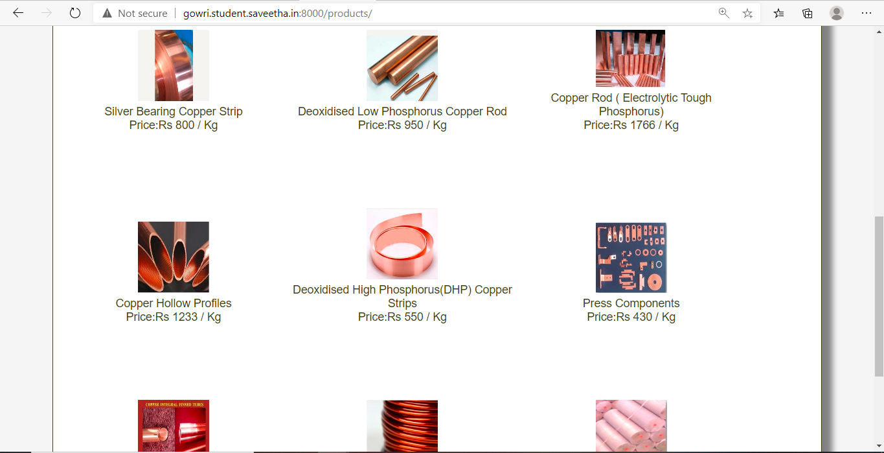

# Web Design for a Manufacturing Company
## AIM: 
To design a static website for a chip manufacturing company.

## DESIGN STEPS:
### Step 1: 
Requirement collection.
### Step 2:
Creating the layout using HTML and CSS.
### Step 3:
Updating the sample content.
### Step 4:
Choose the appropriate style and color scheme.
### Step 5:
Validate the layout in various browsers.
### Step 6:
Validate the HTML code.
### Step 6:
Publish the website in the given URL.

## PROGRAM:

### base.html
```

<!DOCTYPE html>
<html lang="en">

<head>
    <title>Copper Private Limited</title>
    <link rel="stylesheet" href="">
    <link rel = "icon" href ="" type = "image/x-icon"> 
              
</head>

<body>
    <div class="container">
    <div class="banner">
        Copper Private Limited.
    </div>
    <div class="menu">
        <div class="menuitem"><a href="/home">Home</a></div> 
        <div class="menuitem"><a href="/products">Products</a></div> 
        <div class="menuitem"><a href="/people">People</a></div>
        <div class="menuitem"><a href="/contactus">Contact-Us</a></div> 
    </div><div class="content">
        
    
    </div>
    <div class="footer">
        Copyright © 2020 Copper Private Limited, Developed by Gowri.
    </div>
    </div>
</body>

</html>
```

### home.html
```



<div class="homecontent">
    <h1>About Us</h1>
    
    <div class="contenttext">
        Established in the year 2004, we “Copper Private Limited” have gained immense recognition in the domestic market as a
        leading trader of Ferrous & Non – Ferrous metal Products. Procured from authenticated vendors, these products
        are assured to be at par with the international quality standards.
        <h2>Our range encompasses following products:</h2>
        <ul>
            <li>Forging</li>
            <li>Structural Steels</li>
            <li>Plates </li>
            <li>Pipes & Tubes</li>
            <li>Manifold Blocks</li>
            <li>Alloy Steels</li>
            <li>Bright Bars</li>
            <li>Fittings</li>
            <li>Castings</li>
            <li>Industrial Steels</li>
        </ul>
    </div>
</div>

```
### products.html
```



<div class="productcontent">    
    <h1>Our Premium Products</h1>
    <div class="productitems">
        <div class="productitem"> 
            <div class="itemimage">
            
            </div>
            <div class="itemname">Deoxidised Low Phosphorus(DLP) Copper Tubey</div>
            <div class="itemprice">Price: Rs 550  / Kg </div>
        </div>
        <div class="productitem"> 
            <div class="itemimage">
            
            </div>
            <div class="itemname">Tellurium Copper Rod</div>
            <div class="itemprice">Price: Rs 700 / Kg </div>
        </div>
        <div class="productitem"> 
            <div class="itemimage">
            
            </div>
            <div class="itemname">Tellurium Copper Strip</div>
            <div class="itemprice">Price:Rs 730 / Kg </div>
        </div>
         <div class="productitem"> 
            <div class="itemimage">
            
            </div>
            <div class="itemname">Silver Bearing Copper Strip</div>
            <div class="itemprice">Price:Rs 800 / Kg </div>
        </div>
        <div class="productitem"> 
            <div class="itemimage">
            
            </div>
            <div class="itemname">Deoxidised Low Phosphorus Copper Rod</div>
            <div class="itemprice">Price:Rs 950 / Kg </div>
        </div>
        <div class="productitem"> 
            <div class="itemimage">
            
            </div>
            <div class="itemname">Copper Rod ( Electrolytic Tough Phosphorus)</div>
            <div class="itemprice">Price:Rs 1766 / Kg </div>
        </div>
          <div class="productitem"> 
            <div class="itemimage">
            
            </div>
            <div class="itemname">Copper Hollow Profiles</div>
            <div class="itemprice">Price:Rs 1233 / Kg </div>
        </div>
         <div class="productitem"> 
            <div class="itemimage">
            
            </div>
            <div class="itemname">Deoxidised High Phosphorus(DHP) Copper Strips</div>
            <div class="itemprice">Price:Rs 550 / Kg </div>
        </div>
        <div class="productitem"> 
            <div class="itemimage">
            
            </div>
            <div class="itemname">Press Components</div>
            <div class="itemprice">Price:Rs 430 / Kg </div>
        </div>
        <div class="productitem"> 
            <div class="itemimage">
            
            </div>
            <div class="itemname">Integral Finned Tubes</div>
            <div class="itemprice">Price:Rs 1970 / Kg </div>
        </div>
          <div class="productitem"> 
            <div class="itemimage">
            
            </div>
            <div class="itemname">Bare Copper Wire</div>
            <div class="itemprice">Price:Rs 197 / Kg </div>
        </div>
         <div class="productitem"> 
            <div class="itemimage">
            
            </div>
            <div class="itemname">Copper Billet</div>
            <div class="itemprice">Price:Rs 650 </div>
        </div>
    </div>
    </div>
    

```
### people.html
```



<div>
    <h1>Our team</h1>
    <div>
        <div>
            <div>
                
            </div>
            <h2>Shri Aaditkhan</h2>
            <h4>CEO of copper labs </h4>
        </div>
        <div>
            <div>
                
            </div>
            <h2>Andrews</h2>
            <h4>Senior Manager Officer </h4>
        </div>
        <div>
            <div>
                
            </div>
            <h2>Merolin</h2>
            <h4>Chairman of the Copper labs </h4>
        </div>
        <div>
            <div>
                
            </div>
            <h2>Ragunath A.Mashelkar</h2>
            <h4> Chief Financial Officer </h4>
        </div>
        <div>
            <div>
                
            </div>
            <h2>Shri Yogendra P.Trivendi</h2>
            <h4>Marketing Manager </h4>
        </div>
        <div>
            <div>
                
            </div>
            <h2>Prof Deepak C.Jain</h2>
            <h4>Copper Labs' Chief Technology Officer </h4>
        </div>
    </div>
</div>

```
### contactus.html
```



<div>
    <h1>Contact details</h1>
    <div>
        <h2>Contact person:</h2>
            <h4>Vijay Kharti (director)</h4>

        <h2>Address:</h2>
        <h4>Copper Private Limited</h4>
        <h4>No. 1-A, Puliambedu, Numbal,</h4>
        <h4> Off Poonamallee High Road,</h4> 
        <h4>Chennai - 600077,</h4> 
        <h4>Tamil Nadu, India</h4>
        
        <h2>Call us:</h2>
        <h4>080678 54633</h4>
    </div>
    <div>

        <h1>Other contact details</h1>
        <h4>Sales Enquiry</h4>
        <h4> Kavita</h4> 
        <h4>1A puliembedu, Numbal, Off PH Rd,</h4>
        <h4>Chennai - 600077, India</h4>

        <h3>Head Office</h3>
        <h4>Kamal Khatri,</h4>
        <h4>1A Puliembedu, Numbal,</h4> 
        <h4>Off Poonamallee High Road, India</h4>
        
        

        <h3>Branch Office</h3>
        <h4>Vijay Khatri</h4>

        <h3>Head Office</h3>
        <h4>Srinivasan</h4>
        <h4>1A puliembedu, Numbal,</h4>
        <h4> Off PH Rd, Chennai -600077, India</h4>

       </div>
</div>


```

## OUTPUT:





## CODE VALIDATION REPORT:


## RESULT:
Thus a website is designed for the chip manufacturing company and is hosted in the URL http://gowri.student.saveetha.in:8000/. HTML code is validated.